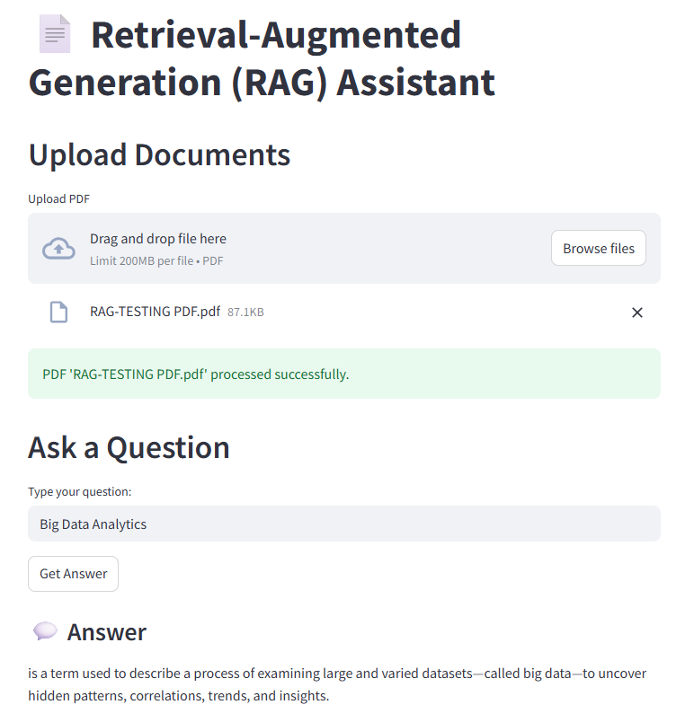

# 📄 RAG-Powered PDF Question Answering System

## 🧠 Overview

This project implements a **Retrieval-Augmented Generation (RAG)** pipeline that allows users to:

- 📤 Upload PDF documents  
- ❓ Ask questions based on their content  
- 💬 Get accurate, context-aware answers from an LLM  

The system leverages:

- 🧠 FAISS for fast vector search  
- 🧬 Sentence Transformers for embeddings  
- 🤖 A transformer-based LLM (`flan-t5-base`) for answer generation  
- 🐳 Docker for easy deployment  

---

## 🖼️ Frontend Screenshot



---

## 🚀 Frontend Deployment Link
You can access the frontend deployment at:
https://vineetg2003-llm---retrieval-augmented-genera-frontendapp-sqpnux.streamlit.app/

- Note:
This frontend link fetches data from your local PC backend. So you must run the backend server on http://localhost:8000 simultaneously using the command below for the frontend to work properly:

```bash
uvicorn app.main:app --reload
```

---

## ⚙️ Features

✅ PDF Upload with chunking + OCR fallback  
✅ Semantic retrieval with FAISS  
✅ Context-aware responses using `flan-t5-base`  
✅ FastAPI-based backend  
✅ Dockerized setup for portability  

---

## 🛠️ Tech Stack

| Layer             | Tool/Library                            |
|------------------|-----------------------------------------|
| Backend API      | FastAPI                                 |
| PDF Processing   | PyPDF2, pdf2image, pytesseract          |
| Embedding        | `all-MiniLM-L6-v2` (Sentence Transformers) |
| Vector Store     | FAISS                                   |
| LLM              | `google/flan-t5-base` (Transformers)    |
| Frontend         | Streamlit                               |
| Containerization | Docker + Docker Compose                 |

---

## 📦 Installation

### 🔧 Prerequisites

- Python 3.9+
- Git
- Docker & Docker Compose
- Poppler & Tesseract (for OCR)

#### 🐧 Ubuntu / Window Setup

```bash
sudo apt update
sudo apt install -y poppler-utils tesseract-ocr

# Clone the repo
git clone https://github.com/yourusername/rag-pdf-qa.git
cd rag-pdf-qa

# Set up virtual environment
python -m venv venv
source venv/bin/activate  # Windows: venv\Scripts\activate

# Install dependencies
pip install -r requirements.txt

# Run FastAPI server
uvicorn app.main:app --reload

# OR Run with Docker
docker-compose up --build

.
├── app/
│   ├── routes.py            # API endpoints
│   ├── chunker.py           # PDF text chunking + OCR fallback
│   ├── retriever.py         # Semantic search using FAISS
│   ├── llm.py               # LLM-based answer generation
│   ├── metadata_store.py    # Metadata DB helper
│   └── main.py              # FastAPI app entrypoint
├── faiss_index.bin          # Persisted vector index
├── chunks.json              # Persisted text chunks
├── requirements.txt
├── Dockerfile
├── docker-compose.yml
└── README.md

```

## 📈 Performance Note

💻 Developed and tested on a system with **8GB RAM**.  
We use `flan-t5-base` (small and efficient).  
For better performance:

- Use `flan-t5-large` or `mistral-7b-instruct` (requires more RAM/GPU)  
- Tune chunk sizes and model max token limits accordingly

---
## 🧪 Testing

- Unit tests cover PDF chunking, vector store indexing, and query handling.
- Integration tests validate end-to-end upload and question-answer workflows.
- Run tests using:

```bash
pytest tests/

```

---

## ⚙️ Configuring Different LLM Providers

The system uses google/flan-t5-base by default.
To switch models, update the MODEL_NAME variable in llm.py:
MODEL_NAME = "your-chosen-llm-model"

---

## 📤 API Usage Guide

### ▶️ Upload a PDF

**Endpoint**: `POST /api/upload/`  
**Content-Type**: `multipart/form-data` with a `.pdf` file  

**Example using curl:**

```bash
curl -X POST "http://localhost:8000/api/upload/" \
  -H "accept: application/json" \
  -F "file=@yourfile.pdf"
```

### ❓ Query the Uploaded Content

**Endpoint**: `POST /api/query/`  
**Content-Type**: `application/json`  
**Request Body**:

```json
{
  "question": "What is the project deadline mentioned in the PDF?"
}

*Example using curl:*
curl -X POST "http://localhost:8000/api/query/" \
  -H "Content-Type: application/json" \
  -d '{"question":"What is the project deadline mentioned in the PDF?"}'

*Response:*
{
  "answer": "The project deadline is June 30, 2025."
}

```

---

## 🐳 Docker Setup & Deployment Guide

This section walks you through setting up and running the entire system using Docker and Docker Compose for easy deployment.

---

### 1. **Prerequisites**

- Install [Docker](https://docs.docker.com/get-docker/) on your machine  
- Install [Docker Compose](https://docs.docker.com/compose/install/) (usually bundled with Docker Desktop)  

Verify installation:

```bash
docker --version
docker-compose --version

```